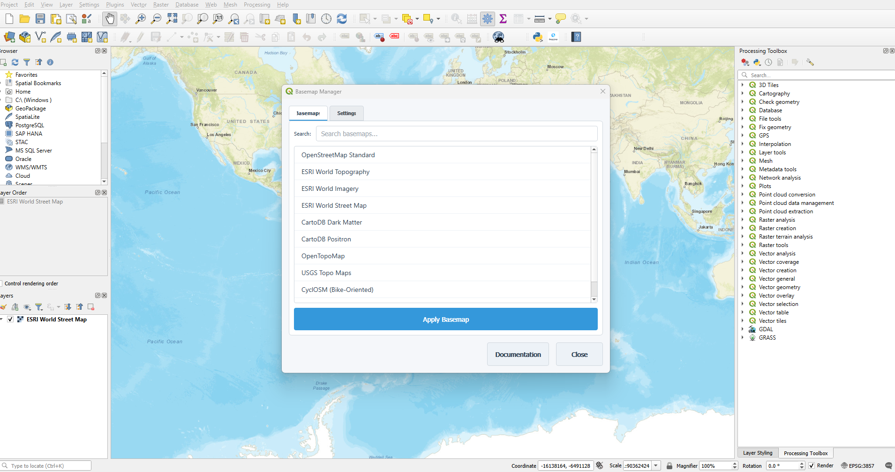

# Basemap Manager for QGIS

[](https://qgis.org)
[](LICENSE)

## Overview
A QGIS plugin that provides one-click access to multiple basemap providers with automatic layer management. Simplify your workflow with preconfigured XYZ tiles and custom template support.



## Features
- 10 preconfigured basemap providers (OSM, Google, ESRI, CartoDB)
- Custom XYZ template support
- Automatic layer management
- CRS auto-correction
- Search-as-you-type filtering
- Persistent settings

## Installation
1. Download the latest release ZIP
2. In QGIS: `Plugins > Manage and Install Plugins > Install from ZIP`
3. Select the downloaded file
4. Restart QGIS

## Usage
1. Click the globe icon in the toolbar
2. Select a basemap from the categorized list
3. Click "Apply" or double-click the basemap name

For detailed instructions, see the [User Guide](docs/USER_GUIDE.md)

## Building from Source
```bash
# Create compressed plugin ZIP
zip -r basemap_manager.zip basemap_manager/*
```

## Dependencies
- QGIS 3.16+
- Python 3.7+
- Internet connection for basemap access

## Contributing
1. Fork the repository
2. Create feature branch (`git checkout -b new-feature`)
3. Commit changes (`git commit -am 'Add new feature'`)
4. Push to branch (`git push origin new-feature`)
5. Create pull request

## License
This project is licensed under the GNU General Public License v3.0 - see [LICENSE](LICENSE) for details.